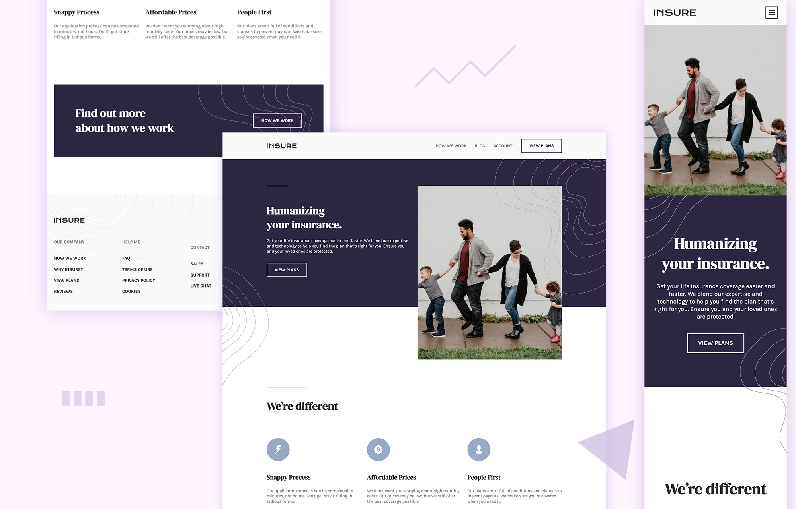

# Insure Landing Page (Frontend Mentor Challenge)

## **[Live Demo](http://danicali.me/insure-landing-page/)** 🎉

# Description

Responsive landing page solution for one of challenges for [frontendmentor.io](https://www.frontendmentor.io/challenges/insure-landing-page-uTU68JV8)

# Main Features

- Followed the principle of Mobile First
- Responsive layouts based on CSS Flexbox
- Used Sass to describe the stylesheets cleanly and structurally
- 3D animations on dropdown menu of mobile view

# Credits

- Designed by [Frontend Mentor](https://www.frontendmentor.io)
- Coded by [Danica](https://github.com/wandanli)
